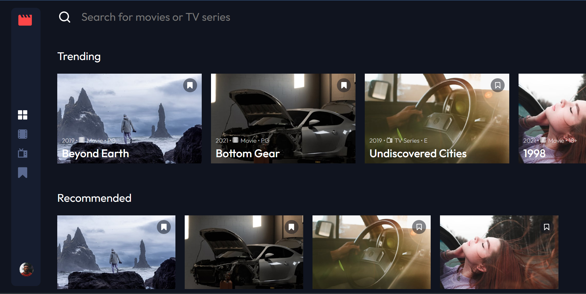

# Frontend Mentor - Entertainment web app solution

My solution to the [Entertainment web app challenge on Frontend Mentor](https://www.frontendmentor.io/challenges/entertainment-web-app-J-UhgAW1X).

## Table of contents

- [Overview](#overview)
  - [The challenge](#the-challenge)
  - [Screenshot](#screenshot)
  - [Links](#links)
- [My process](#my-process)
  - [Built with](#built-with)
  - [Continued development](#continued-development)
- [Author](#author)

## Overview

### The challenge

Users should be able to:

- View the optimal layout for the app depending on their device's screen size
- See hover states for all interactive elements on the page
- Navigate between Home, Movies, TV Series, and Bookmarked Shows pages
- Add/Remove bookmarks from all movies and TV series
- Search for relevant shows on all pages
- **Bonus**: Build this project as a full-stack application
- **Bonus**: If you're building a full-stack app, we provide authentication screen (sign-up/login) designs if you'd like to create an auth flow

### Screenshot

### Links

- Solution URL: [Frontend Mentor](https://www.frontendmentor.io/solutions/entertainment-web-app-built-with-react-Ci7XNmmDJG)
- Live Site URL: [Netlify](https://hcf-entertainment-web-app.netlify.app/)

### Built with

- React
- SASS
- CSS Grids & Flexbox

### Continued development

I'll keep refactoring this code and will implement a Login area in order to create a Full Stack App

## Author

- Website - [Federico Graziani](https://grazianifederico.it)
- Frontend Mentor - [@herecomesfed](https://www.frontendmentor.io/profile/herecomesfed)
